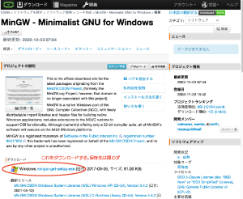
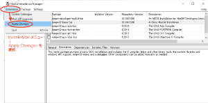

# gccコンパイラ（コマンド）のインストール

参考サイト：<https://dianxnao.com/windows%e3%81%abc%e8%a8%80%e8%aa%9e%e9%96%8b%e7%99%ba%e7%92%b0%e5%a2%83-mingw-w64%ef%bc%88gcc%e3%82%b3%e3%83%b3%e3%83%91%e3%82%a4%e3%83%a9%ef%bc%89%e3%82%92%e5%b0%8e%e5%85%a5%e3%81%99%e3%82%8b/>

## 直接的にやること：MinGW のインストール

<ruby>**MinGW**<rp>（</rp><rt>ミングゥ</rt><rp>）</rp></ruby>:
<font color="red">**Min**</font>imalist
<font color="red">**G**</font>NU for
<font color="red">**W**</font>indows\
（Windows用に構築された最小限のOS操作ツール(GNU)）

gccコンパイラはMingGWを通して導入します。

### 1) <https://ja.osdn.net/projects/mingw/> へアクセス



### 2) mingw-get-setup.exe を実行

ファイルをダブルクリックする


### 3) MinGW-get セットアップ画面の指示に従う


↑「Install」ボタンを押す↑

<hr>


↑各種設定箇所はそのままでok。「Continue」で続ける。

以下、```Continue```とか```OK```とかで進み続けてよい。<br>
**インストール完了するまでの間で何かエラー画面ぽいのが出たら、教員や知ってそうな同級生・上級生を呼んで、その画面を見せてください。**

### 4) MinGW-get を起動する

（たぶん、インストール完了したら勝手に起動してくれます）




この後は表示されるがままに進める。
