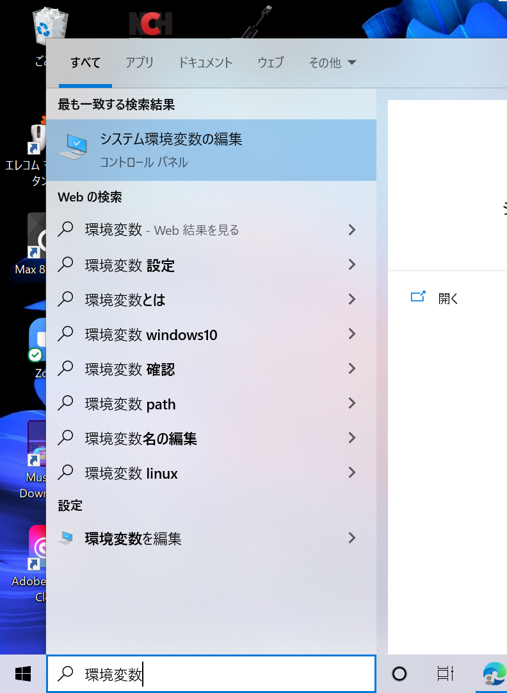
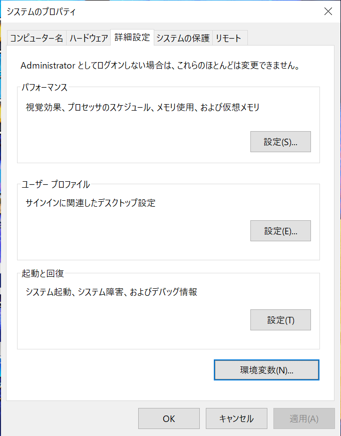
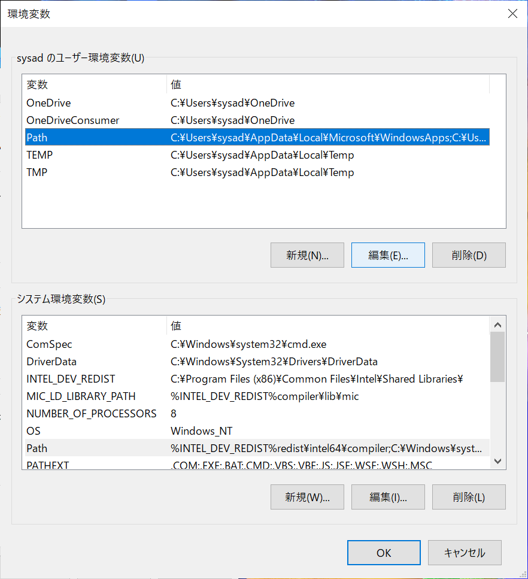
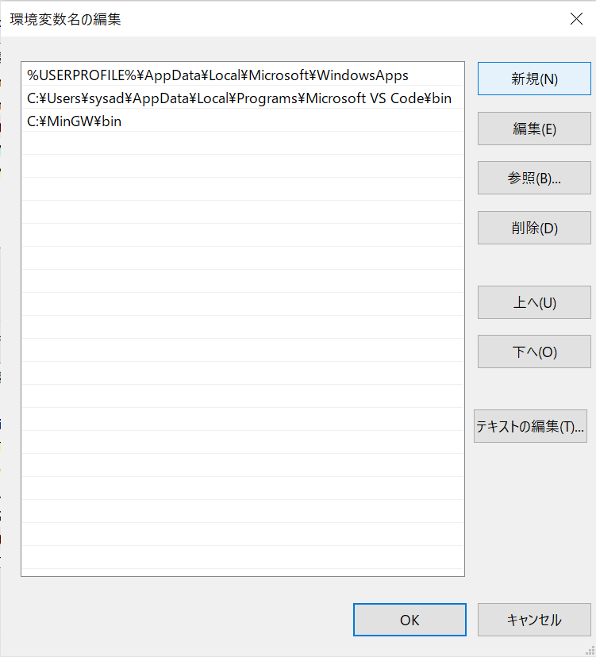
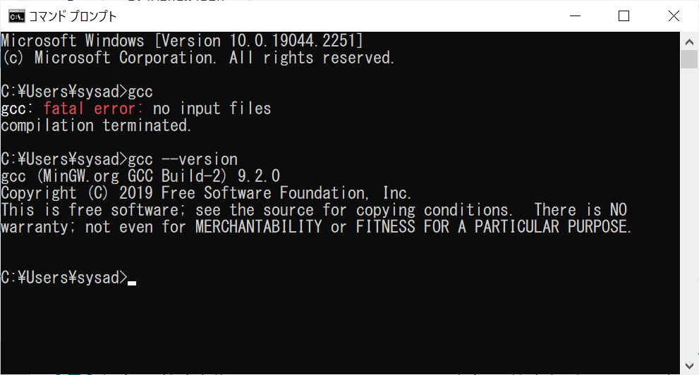

# gccの「<ruby>PATH<rt>パス</rt></ruby>を通す」

何かのプログラムを実行する際は、PC内の特定のフォルダを参照できるようにしておくなどのシステム環境設定が必要になります。特にプログラミング関係でPCのパラメータ設定を施す機会が多いのですが、それを指す表現として「パスを通す」という言い方をします。

もう少し正確には「**システム環境設定でPATHを通す**」と言います。\
もっと厳密に言うと「"システム環境設定"でPATHという<ruby>項目<rt>パラメータ(変数)</rt></ruby>に、とあるフォルダのアドレスを指定する」となります。


## 準備：gcc.exe ファイルの<ruby>所在<rt>アドレス</rt></ruby>を確認する

[前記事](setup_gcc.md)の通りに操作したら
```C:\MinGW\bin``` にあるはず

- あった：　　　　　「```C:\MinGW\bin```」をコピーしてください
- 別の場所だった：　所在のアドレスをコピーしてください

## システム環境設定画面でgccの場所を指定する

（なんかWebにゃいろいろ細かく書いてた記事が多数だったけど）

1. Windows/スタート メニューの検索欄で「環境変数」と記入
2. 「システム環境設定の編集」を選ぶ
   1. 「システムのプロパティ」というタイトルの画面で
      1. ユーザー もしくは システムの「```Path```」行をダブルクリック（または```編集```ボタンを押す）
         1. ```新規``` ボタンを押して、コピーしておいたアドレスを貼り付ける（Ctrl + V）。できたら ```Enter```キーを押して確定。
         2. 右下の```OK```ボタンを押す（→画面が消える）。
      2. 右下の```OK```ボタンを押す（→画面が消える）。
   2. 右下の```OK```ボタンを押す（→画面が消える）。









## PATHが通ったかを確認する

### コマンドプロンプト（またはターミナル）を開く

1. Windows/スタートボタン の検索欄で```cmd``` か ```terminal```と記入
2. ```コマンドプロンプト```というアプリ(?)を選ぶ
3. 確認１：```gcc``` と記入して ```Enter```キーを押す
4. 確認２：```gcc --version```と記入して ```Enter```キーを押す



<hr>

ここまで到達したら [戻る](README.md)
